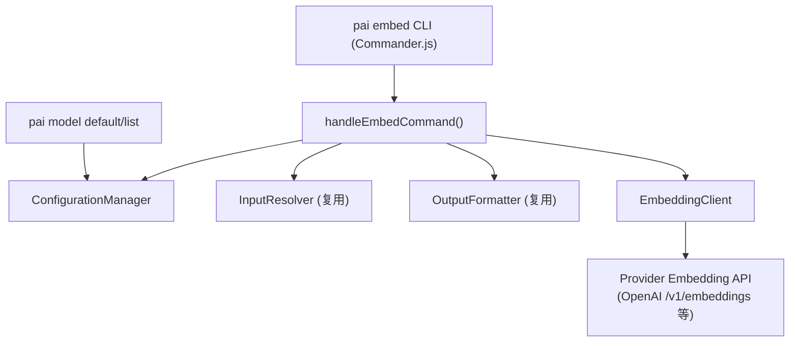

# 设计文档：pai embed 子命令

## 概述

本设计为 PAI CLI 新增 `pai embed` 子命令，用于计算文本的嵌入向量。核心设计原则：

1. 复用现有基础设施（ConfigurationManager、OutputFormatter、InputResolver、错误处理体系）
2. 由于 pi-ai 库不支持 Embedding API，新增独立的 `EmbeddingClient` 直接调用 Provider HTTP 端点
3. 扩展 PAIConfig 类型以支持全局默认嵌入模型配置
4. 扩展 `pai model` 命令以展示和管理嵌入模型配置

## 架构



数据流：

1. CLI 解析参数 → `handleEmbedCommand()`
2. `ConfigurationManager` 加载配置，解析 Provider 和嵌入模型
3. `InputResolver` 解析输入文本（位置参数 / stdin / `--input-file`）
4. 若 `--batch`，将输入内容解析为 JSON 字符串数组
5. `EmbeddingClient` 调用 Provider 的 Embedding API
6. `OutputFormatter` 格式化输出到 stdout/stderr

## 组件与接口

### 1. Embed 命令处理器 (`src/commands/embed.ts`)

```typescript
export interface EmbedOptions extends CLIOptions {
  provider?: string;
  model?: string;
  inputFile?: string;
  batch?: boolean;
}

export async function handleEmbedCommand(
  text: string | undefined,
  options: EmbedOptions
): Promise<void>;
```

职责：
- 解析输入（复用 InputResolver 的 stdin/file 读取能力）
- 解析 Provider 和模型（优先级：CLI 参数 > defaultEmbedProvider/defaultEmbedModel > defaultProvider）
- 在 `--batch` 模式下将输入解析为 JSON 字符串数组
- 调用 EmbeddingClient 获取嵌入向量
- 通过 OutputFormatter 输出结果

### 2. 嵌入客户端 (`src/embedding-client.ts`)

```typescript
export interface EmbeddingRequest {
  texts: string[];
  model: string;
}

export interface EmbeddingResponse {
  embeddings: number[][];
  model: string;
  usage: {
    promptTokens: number;
    totalTokens: number;
  };
}

export class EmbeddingClient {
  constructor(config: {
    provider: string;
    apiKey: string;
    model: string;
    baseUrl?: string;
  });

  async embed(request: EmbeddingRequest): Promise<EmbeddingResponse>;
}
```

职责：
- 构建 HTTP 请求调用 Provider 的 Embedding API
- 支持 OpenAI 兼容端点（`POST /v1/embeddings`）
- 解析 API 响应，提取嵌入向量和 usage 信息
- 将 API 错误转换为 PAIError

API 端点解析逻辑：
- 若 ProviderConfig 有 `baseUrl`，使用 `${baseUrl}/v1/embeddings`
- 否则使用 Provider 默认端点（如 OpenAI: `https://api.openai.com/v1/embeddings`）

已知 Provider 默认端点映射：

| Provider | 默认 Base URL |
|----------|--------------|
| openai | `https://api.openai.com` |
| azure-openai | 使用 baseUrl 配置 |
| 其他 OpenAI 兼容 | 使用 baseUrl 配置 |

### 3. 配置扩展

扩展 `PAIConfig` 接口：

```typescript
export interface PAIConfig {
  schema_version: string;
  defaultProvider?: string;
  defaultEmbedProvider?: string;  // 新增
  defaultEmbedModel?: string;     // 新增
  providers: ProviderConfig[];
}
```

模型解析优先级（embed 命令）：
1. CLI `--provider` / `--model` 参数
2. PAIConfig.`defaultEmbedProvider` / `defaultEmbedModel`
3. PAIConfig.`defaultProvider`（回退到 chat 的默认 Provider，但模型需要显式指定）

### 4. Model 命令扩展

扩展 `pai model default` 命令：

```typescript
// 新增选项
.option('--embed-provider <name>', '设置默认嵌入 Provider')
.option('--embed-model <model>', '设置默认嵌入模型')
```

扩展 `pai model list` 输出：
- 人类可读模式：在头部显示 `Default Embed: <provider>/<model>`
- JSON 模式：在输出对象中包含 `defaultEmbedProvider` 和 `defaultEmbedModel` 字段

## 数据模型

### 嵌入模型 Token 限制数据

内置常用嵌入模型的最大 token 限制（硬编码）：

```typescript
export const EMBEDDING_MODEL_LIMITS: Record<string, number> = {
  // OpenAI
  'text-embedding-3-small': 8191,
  'text-embedding-3-large': 8191,
  'text-embedding-ada-002': 8191,
  // Google
  'text-embedding-004': 2048,
  // Cohere
  'embed-english-v3.0': 512,
  'embed-multilingual-v3.0': 512,
  'embed-english-light-v3.0': 512,
  'embed-multilingual-light-v3.0': 512,
};
```

截断策略：
- 使用简单的字符级截断（按 token 估算比例：1 token ≈ 4 字符）
- 当输入文本估算 token 数超过模型限制时，截断至限制范围内
- 在 stderr 输出警告信息
- 若模型不在内置数据中，跳过截断检查

### 嵌入 API 请求体（OpenAI 兼容格式）

```json
{
  "model": "text-embedding-3-small",
  "input": ["hello world"]
}
```

### 嵌入 API 响应体（OpenAI 兼容格式）

```json
{
  "object": "list",
  "data": [
    {
      "object": "embedding",
      "index": 0,
      "embedding": [0.0023, -0.0094, ...]
    }
  ],
  "model": "text-embedding-3-small",
  "usage": {
    "prompt_tokens": 2,
    "total_tokens": 2
  }
}
```

### stdout 输出格式

单条模式（无 `--json`）：
```
[0.0023064255,-0.009327292,0.015797347,...]
```

批量模式（无 `--json`）：
```
[0.0023064255,-0.009327292,0.015797347,...]
[0.0112345678,-0.023456789,0.034567890,...]
```

单条模式（`--json`）：
```json
{
  "embedding": [0.0023, -0.0094, ...],
  "model": "text-embedding-3-small",
  "usage": { "prompt_tokens": 2, "total_tokens": 2 }
}
```

批量模式（`--json`）：
```json
{
  "embeddings": [
    [0.0023, -0.0094, ...],
    [0.0112, -0.0234, ...]
  ],
  "model": "text-embedding-3-small",
  "usage": { "prompt_tokens": 4, "total_tokens": 4 }
}
```

### 配置文件扩展示例

```json
{
  "schema_version": "1.0.0",
  "defaultProvider": "openai",
  "defaultEmbedProvider": "openai",
  "defaultEmbedModel": "text-embedding-3-small",
  "providers": [
    {
      "name": "openai",
      "apiKey": "sk-...",
      "defaultModel": "gpt-4o-mini"
    }
  ]
}
```

## 正确性属性

*正确性属性是一种在系统所有合法执行中都应成立的特征或行为——本质上是关于系统应该做什么的形式化陈述。属性是人类可读规范与机器可验证正确性保证之间的桥梁。*

### Property 1: 多输入源互斥

*For any* 输入源组合，当同时提供两个或以上输入源（位置参数、stdin、`--input-file`）时，Embed_Command 应返回退出码 1 的参数错误。

**Validates: Requirements 1.4**

### Property 2: 批量 JSON 解析有效性

*For any* 字符串，当该字符串是合法的 JSON 字符串数组时，批量解析器应正确提取所有字符串元素且不丢失不增加；当该字符串不是合法的 JSON 字符串数组（非法 JSON、非数组、数组元素非字符串）时，批量解析器应返回错误。

**Validates: Requirements 2.1, 2.6**

### Property 3: 批量结果顺序保持

*For any* 文本数组输入，批量嵌入的输出结果中第 i 个嵌入向量应对应第 i 个输入文本（即输出顺序与输入顺序一致）。

**Validates: Requirements 2.5**

### Property 4: 纯文本输出格式

*For any* 嵌入向量（浮点数数组），纯文本格式化器应输出单行 JSON 数组格式（单条模式一行，批量模式每条一行），且输出的浮点数值与原始向量数值一致。

**Validates: Requirements 3.1**

### Property 5: JSON 输出格式

*For any* 嵌入结果（包含向量、模型名、usage 信息），JSON 格式化器应输出合法的 JSON 对象，单条模式包含 `embedding` 字段，批量模式包含 `embeddings` 字段，且均包含 `model` 和 `usage` 字段，所有字段值与原始数据一致。

**Validates: Requirements 3.2**

### Property 6: 配置 round-trip

*For any* 包含 `defaultEmbedProvider` 和 `defaultEmbedModel` 字段的 PAIConfig 对象，序列化为 JSON 后再反序列化应得到等价的对象（新增字段不丢失）。

**Validates: Requirements 4.1, 4.2**

### Property 7: 嵌入模型解析优先级

*For any* 配置状态（含或不含 defaultEmbedProvider/defaultEmbedModel/defaultProvider）和 CLI 参数组合，模型解析应遵循优先级：CLI `--provider`/`--model` > `defaultEmbedProvider`/`defaultEmbedModel` > `defaultProvider` 回退。

**Validates: Requirements 4.3, 4.4**

### Property 8: baseUrl 端点构建

*For any* baseUrl 字符串，EmbeddingClient 构建的 API 端点应为 `${baseUrl}/v1/embeddings`；当无 baseUrl 时应使用 Provider 默认端点。

**Validates: Requirements 6.3**

### Property 9: API 错误映射

*For any* HTTP 错误响应（状态码 4xx/5xx），EmbeddingClient 应抛出 PAIError 且退出码为 3（API 错误）。

**Validates: Requirements 6.4**

### Property 10: 文本截断正确性

*For any* 嵌入模型（在内置限制数据中）和任意长度的输入文本，截断后的文本估算 token 数应不超过该模型的最大 token 限制；当输入文本未超过限制时，截断函数应返回原始文本不变。

**Validates: Requirements 7.1, 7.2**

## 错误处理

错误处理遵循现有 PAI 错误体系：

| 场景 | 退出码 | 错误类型 |
|------|--------|---------|
| 未配置 Provider | 1 | PARAMETER_ERROR |
| Provider 不存在 | 1 | PARAMETER_ERROR |
| 无输入文本 | 1 | PARAMETER_ERROR |
| 多输入源冲突 | 1 | PARAMETER_ERROR |
| 批量 JSON 格式错误 | 1 | PARAMETER_ERROR |
| 网络请求失败 | 2 | RUNTIME_ERROR |
| API 认证失败 | 3 | API_ERROR |
| API 模型不支持 | 3 | API_ERROR |
| API 其他错误 | 3 | API_ERROR |
| 输入文件不可读 | 4 | IO_ERROR |

文本截断不是错误，而是警告：
- 截断时在 stderr 输出 `[Warning] Input text truncated from ~X tokens to Y tokens (model limit: Y)`
- `--json` 模式下输出 NDJSON 警告事件：`{"type":"warning","data":{"message":"...","originalTokens":X,"truncatedTokens":Y}}`

错误输出格式：
- 无 `--json`：人类可读错误写入 stderr
- 有 `--json`：NDJSON 错误事件写入 stderr，格式与现有 OutputFormatter 一致

## 测试策略

### 属性测试（Property-Based Testing）

使用 `fast-check` 库进行属性测试，每个属性至少运行 100 次迭代。

需要测试的属性：
- **Property 1**: 多输入源互斥 — 生成随机输入源组合，验证多源时报错
- **Property 2**: 批量 JSON 解析 — 生成随机 JSON 字符串（合法/非法），验证解析行为
- **Property 3**: 批量顺序保持 — 生成随机文本数组，mock API 返回带 index 的结果，验证顺序
- **Property 4**: 纯文本输出格式 — 生成随机浮点数数组，验证格式化输出
- **Property 5**: JSON 输出格式 — 生成随机嵌入结果，验证 JSON 结构
- **Property 6**: 配置 round-trip — 生成随机 PAIConfig，验证序列化/反序列化一致性
- **Property 7**: 模型解析优先级 — 生成随机配置和 CLI 参数组合，验证解析结果
- **Property 8**: baseUrl 端点构建 — 生成随机 URL 字符串，验证端点拼接
- **Property 9**: API 错误映射 — 生成随机 HTTP 错误状态码，验证 PAIError 退出码
- **Property 10**: 文本截断正确性 — 生成随机长度文本和随机模型限制，验证截断后不超限且短文本不变

每个属性测试需标注：
```
// Feature: embed-command, Property N: <property_text>
```

### 单元测试

单元测试聚焦于具体示例和边界情况：
- 空输入处理
- 空批量数组处理
- 各输入源的基本功能验证
- Provider 不存在时的错误处理
- 文件不存在时的 IO 错误
- API 错误响应的具体格式

### 测试框架

- 测试框架：vitest
- 属性测试库：fast-check
- HTTP mock：vitest 的 `vi.fn()` mock fetch/HTTP 调用
- 配置：复用现有 `vitest.config.ts`（已配置 10s 超时，适合属性测试）
