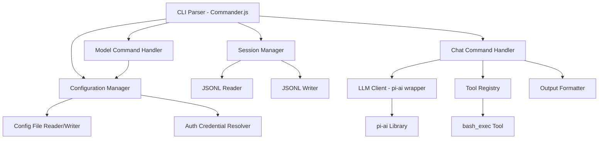
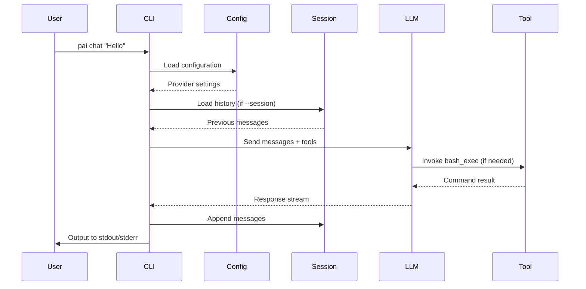

# Design Document: PAI CLI Tool

## Overview

PAI is a TypeScript-based command-line tool that provides a Unix-friendly interface to the @mariozechner/pi-ai library. The design follows Unix philosophy principles: do one thing well, compose with other tools via pipes, separate output streams for data and diagnostics, and support both human and machine-readable formats.

The architecture consists of four main layers:
1. **CLI Layer**: Command parsing and validation using Commander.js
2. **Configuration Layer**: Config file and credential resolution
3. **Session Layer**: JSONL-based conversation history management
4. **Execution Layer**: LLM interaction via pi-ai library with tool support

## Architecture

### High-Level Component Diagram



### Data Flow



## Components and Interfaces

### 1. CLI Parser (index.ts)

Entry point using Commander.js for command parsing.

```typescript
interface CLIOptions {
  config?: string;
  json?: boolean;
  quiet?: boolean;
}

interface ChatOptions extends CLIOptions {
  session?: string;
  system?: string;
  systemFile?: string;
  inputFile?: string;
  image?: string[];
  provider?: string;
  model?: string;
  temperature?: number;
  maxTokens?: number;
  stream?: boolean;
  log?: string;
}

interface ModelConfigOptions extends CLIOptions {
  add?: boolean;
  delete?: boolean;
  all?: boolean;
}

// Main command structure
program
  .name('pai')
  .description('CLI tool for LLM interaction');

program
  .command('chat')
  .description('Chat with an LLM')
  .argument('[message]', 'User message')
  .option('--session <file>', 'Session file path')
  .option('--system <text>', 'System instruction')
  // ... other options
  .action(handleChatCommand);

program
  .command('model')
  .description('Manage model configurations')
  .command('list')
  .option('--all', 'Show all supported providers')
  .action(handleModelList);

program
  .command('model')
  .command('config')
  .option('--add', 'Add/update provider')
  .option('--delete', 'Delete provider')
  .action(handleModelConfig);
```

### 2. Configuration Manager

Handles config file resolution, reading, writing, and credential resolution.

```typescript
interface ProviderConfig {
  name: string;
  apiKey?: string;
  models?: string[];
  defaultModel?: string;
  temperature?: number;
  maxTokens?: number;
}

interface PAIConfig {
  schema_version: string;
  defaultProvider?: string;
  providers: ProviderConfig[];
}

class ConfigurationManager {
  private configPath: string;
  
  constructor(options: CLIOptions) {
    // Priority: --config > PAI_CONFIG env > ~/config/pai/default.json
    this.configPath = options.config 
      || process.env.PAI_CONFIG 
      || path.join(os.homedir(), 'config', 'pai', 'default.json');
  }
  
  async loadConfig(): Promise<PAIConfig> {
    // Read and parse config file
    // Return default config if file doesn't exist
  }
  
  async saveConfig(config: PAIConfig): Promise<void> {
    // Write config file with proper formatting
    // Create directory if needed
  }
  
  resolveCredentials(provider: string, cliKey?: string): string {
    // Priority: CLI param > env var > config file > auth.json
    // Check PAI_<PROVIDER>_API_KEY env vars
    // Fall back to auth.json for OAuth providers
  }
  
  getProvider(name?: string): ProviderConfig {
    // Return specified provider or default
    // Throw error if not found
  }
}
```

### 3. Session Manager

Manages JSONL session files for conversation history.

```typescript
type MessageRole = 'system' | 'user' | 'assistant' | 'tool';

type MessageContent = string | object | any[];

interface Message {
  role: MessageRole;
  content: MessageContent;
  name?: string; // For tool messages
  tool_call_id?: string; // For tool responses
}

class SessionManager {
  private sessionPath?: string;
  
  constructor(sessionPath?: string) {
    this.sessionPath = sessionPath;
  }
  
  async loadMessages(): Promise<Message[]> {
    // Read JSONL file line by line
    // Parse each line as JSON
    // Return array of messages
    // Return empty array if file doesn't exist
  }
  
  async appendMessage(message: Message): Promise<void> {
    // Append single JSON line to file
    // Create file if doesn't exist
    // Handle concurrent writes (TODO: not in initial version)
  }
  
  async appendMessages(messages: Message[]): Promise<void> {
    // Append multiple messages
    // Use atomic write if possible
  }
}
```

### 4. LLM Client Wrapper

Wraps pi-ai library with PAI-specific configuration.

```typescript
interface LLMClientConfig {
  provider: string;
  model: string;
  apiKey: string;
  temperature?: number;
  maxTokens?: number;
  stream?: boolean;
}

interface LLMResponse {
  content: string;
  toolCalls?: ToolCall[];
  finishReason: string;
}

interface ToolCall {
  id: string;
  name: string;
  arguments: any;
}

class LLMClient {
  private client: any; // pi-ai client instance
  private config: LLMClientConfig;
  
  constructor(config: LLMClientConfig) {
    this.config = config;
    // Initialize pi-ai client based on provider
  }
  
  async chat(
    messages: Message[], 
    tools?: Tool[]
  ): AsyncGenerator<LLMResponse> {
    // Call pi-ai library
    // Yield streaming responses if stream=true
    // Handle tool calls
  }
  
  async chatComplete(
    messages: Message[], 
    tools?: Tool[]
  ): Promise<LLMResponse> {
    // Non-streaming version
    // Collect full response before returning
  }
}
```

### 5. Tool Registry

Manages available tools for LLM to invoke.

```typescript
interface Tool {
  name: string;
  description: string;
  parameters: object; // JSON Schema
  handler: (args: any) => Promise<any>;
}

class ToolRegistry {
  private tools: Map<string, Tool>;
  
  constructor() {
    this.tools = new Map();
    this.registerBuiltinTools();
  }
  
  private registerBuiltinTools(): void {
    this.register(createBashExecTool());
  }
  
  register(tool: Tool): void {
    this.tools.set(tool.name, tool);
  }
  
  get(name: string): Tool | undefined {
    return this.tools.get(name);
  }
  
  getAll(): Tool[] {
    return Array.from(this.tools.values());
  }
  
  async execute(name: string, args: any): Promise<any> {
    const tool = this.get(name);
    if (!tool) throw new Error(`Tool not found: ${name}`);
    return await tool.handler(args);
  }
}
```

### 6. bash_exec Tool

Executes shell commands via bash.

```typescript
interface BashExecArgs {
  command: string;
  cwd?: string;
}

interface BashExecResult {
  stdout: string;
  stderr: string;
  exitCode: number;
}

function createBashExecTool(): Tool {
  return {
    name: 'bash_exec',
    description: 'Execute a bash command and return the result',
    parameters: {
      type: 'object',
      properties: {
        command: {
          type: 'string',
          description: 'The bash command to execute'
        },
        cwd: {
          type: 'string',
          description: 'Working directory for command execution'
        }
      },
      required: ['command']
    },
    handler: async (args: BashExecArgs): Promise<BashExecResult> => {
      // Use child_process.exec with bash shell
      // Set cwd if provided
      // Capture stdout, stderr, exit code
      // Return all information to LLM
      // No timeout or security restrictions
    }
  };
}
```

### 7. Output Formatter

Handles stdout/stderr formatting based on flags.

```typescript
interface OutputEvent {
  type: 'start' | 'chunk' | 'tool_call' | 'tool_result' | 'complete' | 'error';
  data: any;
  timestamp?: number;
}

class OutputFormatter {
  private jsonMode: boolean;
  private quietMode: boolean;
  private logFile?: string;
  
  constructor(jsonMode: boolean, quietMode: boolean, logFile?: string) {
    this.jsonMode = jsonMode;
    this.quietMode = quietMode;
    this.logFile = logFile;
  }
  
  writeModelOutput(content: string): void {
    // Always write to stdout
    process.stdout.write(content);
    
    // Also append to log file if specified
    if (this.logFile) {
      this.appendToLog('assistant', content);
    }
  }
  
  writeProgress(event: OutputEvent): void {
    // Skip if quiet mode
    if (this.quietMode) return;
    
    // Format based on json mode
    if (this.jsonMode) {
      this.writeNDJSON(event);
    } else {
      this.writeHumanReadable(event);
    }
  }
  
  writeError(error: Error): void {
    // Always write errors to stderr
    process.stderr.write(`Error: ${error.message}\n`);
  }
  
  private writeNDJSON(event: OutputEvent): void {
    // Write single-line JSON to stderr
    process.stderr.write(JSON.stringify(event) + '\n');
  }
  
  private writeHumanReadable(event: OutputEvent): void {
    // Format event as human-readable text
    // Write to stderr
  }
  
  private async appendToLog(role: string, content: string): Promise<void> {
    // Append to log file in Markdown format
    // Include timestamp and role
  }
}
```

### 8. Input Resolver

Resolves user input from various sources.

```typescript
interface InputSource {
  message?: string; // CLI argument
  stdin?: boolean;
  file?: string;
  images?: string[];
}

class InputResolver {
  async resolveUserInput(source: InputSource): Promise<MessageContent> {
    // Check for multiple sources - error if more than one
    // Read from appropriate source
    // Handle multimodal content (text + images)
    // Return content in pi-ai compatible format
  }
  
  async resolveSystemInput(
    systemText?: string, 
    systemFile?: string
  ): Promise<string> {
    // Error if both provided
    // Read from file if systemFile specified
    // Return systemText if provided
    // Return undefined if neither
  }
  
  private async readStdin(): Promise<string> {
    // Read all data from stdin
    // Return as string
  }
  
  private async readFile(path: string): Promise<string> {
    // Read file content
    // Throw error with exit code 4 on failure
  }
  
  private async readImage(path: string): Promise<object> {
    // Read image file
    // Encode in format compatible with pi-ai
    // Return as object with type and data
  }
}
```

## Data Models

### Configuration File Format

```json
{
  "schema_version": "1.0.0",
  "defaultProvider": "openai",
  "providers": [
    {
      "name": "openai",
      "apiKey": "sk-...",
      "models": ["gpt-4", "gpt-3.5-turbo"],
      "defaultModel": "gpt-4",
      "temperature": 0.7,
      "maxTokens": 2000
    },
    {
      "name": "anthropic",
      "apiKey": "sk-ant-...",
      "models": ["claude-3-opus", "claude-3-sonnet"],
      "defaultModel": "claude-3-sonnet"
    }
  ]
}
```

### Session File Format (JSONL)

```jsonl
{"role":"system","content":"You are a helpful assistant."}
{"role":"user","content":"What is 2+2?"}
{"role":"assistant","content":"2+2 equals 4."}
{"role":"user","content":"Can you check the current directory?"}
{"role":"assistant","content":"I'll check that for you.","tool_calls":[{"id":"call_123","name":"bash_exec","arguments":{"command":"pwd"}}]}
{"role":"tool","name":"bash_exec","tool_call_id":"call_123","content":{"stdout":"/home/user\n","stderr":"","exitCode":0}}
{"role":"assistant","content":"The current directory is /home/user"}
```

### Log File Format (Markdown)

```markdown
## Chat Session - 2024-01-15 14:30:00

### System
You are a helpful assistant.

### User (14:30:05)
What is 2+2?

### Assistant (14:30:06)
2+2 equals 4.

### User (14:30:15)
Can you check the current directory?

### Assistant (14:30:16)
I'll check that for you.

**Tool Call:** bash_exec
```json
{"command": "pwd"}
```

**Tool Result:**
```json
{"stdout": "/home/user\n", "stderr": "", "exitCode": 0}
```

The current directory is /home/user
```

## Correctness Properties


*A property is a characteristic or behavior that should hold true across all valid executions of a system—essentially, a formal statement about what the system should do. Properties serve as the bridge between human-readable specifications and machine-verifiable correctness guarantees.*

### Property 1: Provider Information Display Completeness

*For any* provider configuration, when displayed by `pai model list`, the output should contain the provider name, all configured models, and authentication status.

**Validates: Requirements 1.3**

### Property 2: Malformed Config Error Handling

*For any* malformed JSON in the config file, attempting to load the configuration should output an error to stderr and exit with code 4.

**Validates: Requirements 1.5**

### Property 3: Configuration Persistence Round-Trip

*For any* valid provider configuration, adding it via `pai model config --add` and then listing providers should show that configuration with all specified details preserved.

**Validates: Requirements 2.1**

### Property 4: Configuration Deletion

*For any* existing provider in the config file, executing `pai model config --delete` with that provider name should result in the provider no longer appearing in the configuration.

**Validates: Requirements 2.2**

### Property 5: Provider Validation

*For any* provider name not supported by pi-ai library, attempting to add it via `pai model config --add` should fail with an error and exit code 1.

**Validates: Requirements 2.3**

### Property 6: Exit Code Correctness

*For any* PAI command execution:
- Successful operations should exit with code 0
- Parameter/usage errors should exit with code 1
- Local runtime errors should exit with code 2
- External API/provider errors should exit with code 3
- IO/file errors should exit with code 4

**Validates: Requirements 2.5, 2.6, 2.7, 5.8, 5.9, 14.1, 14.2, 14.3, 14.4, 14.5**

### Property 7: Config Path Resolution Priority

*For any* combination of config path sources (--config flag, PAI_CONFIG env var, default path), the PAI should use the highest priority source in order: --config flag > PAI_CONFIG > default path.

**Validates: Requirements 3.4**

### Property 8: Config Schema Version Invariant

*For any* config file created or modified by PAI, it should contain a schema_version field.

**Validates: Requirements 3.5**

### Property 9: Credential Resolution Priority

*For any* provider requiring authentication, PAI should resolve credentials in priority order: CLI parameters > environment variables > config file > auth.json, using the first available source.

**Validates: Requirements 4.1, 4.2, 4.3**

### Property 10: Sensitive Data Exclusion

*For any* output produced by PAI (stdout or stderr), it should not contain API keys, OAuth tokens, or other sensitive authentication credentials.

**Validates: Requirements 4.6**

### Property 11: JSON Output Format Validity

*For any* execution with --json flag, all lines written to stderr should be valid JSON objects (NDJSON format).

**Validates: Requirements 5.5**

### Property 12: Model Output Routing Invariant

*For any* chat command execution, the model's response content should be written to stdout, progress/diagnostic information should be written to stderr, and stdout should contain only the model output.

**Validates: Requirements 5.7, 13.1, 13.2, 13.6**

### Property 13: Session File JSONL Format

*For any* message written to a session file, it should be valid JSON on a single line, and should include both a role field (system/user/assistant/tool) and a content field.

**Validates: Requirements 6.3, 6.4**

### Property 14: Malformed Session Error Handling

*For any* session file containing invalid JSONL (malformed JSON or multiple objects per line), attempting to load it should output an error to stderr and exit with code 4.

**Validates: Requirements 6.7**

### Property 15: Multimodal Content Round-Trip

*For any* message with multimodal content (text, images, or mixed), writing it to a session file and reading it back should preserve the content structure and all data.

**Validates: Requirements 6.8, 11.5**

### Property 16: Input Source Mutual Exclusivity

*For any* chat command where multiple input sources are specified (positional arg + stdin, or positional arg + --input-file, or stdin + --input-file), PAI should output an error to stderr and exit with code 1.

**Validates: Requirements 8.4**

### Property 17: Bash Feature Support

*For any* bash command using pipes, xargs, heredoc, or shell scripts, the bash_exec tool should execute it correctly and return stdout, stderr, and exit code.

**Validates: Requirements 9.3**

### Property 18: Command Result Structure

*For any* bash_exec tool invocation, the result returned to the LLM should include stdout (string), stderr (string), and exitCode (number) fields.

**Validates: Requirements 9.5**

### Property 19: Invalid Parameter Rejection

*For any* invalid model parameter value (temperature out of range, negative max tokens, etc.), PAI should output an error to stderr and exit with code 1.

**Validates: Requirements 10.4**

### Property 20: Log File Timestamp Presence

*For any* message written to a log file, the log entry should include a timestamp.

**Validates: Requirements 12.2**

### Property 21: Log File Message Distinction

*For any* log file with multiple messages, system, user, and assistant messages should be clearly distinguishable by different formatting or markers.

**Validates: Requirements 12.3**

### Property 22: Error Message Context

*For any* error output to stderr, the message should include relevant context such as file paths, parameter names, or operation details that help identify the error source.

**Validates: Requirements 14.7**

### Property 23: Provider Existence Validation

*For any* provider name specified via --provider flag that is not in the config file, PAI should output an error to stderr and exit with code 1.

**Validates: Requirements 15.5**

## Error Handling

### Error Categories and Exit Codes

PAI uses distinct exit codes to enable proper error handling in scripts:

- **Exit 0**: Successful operation
- **Exit 1**: User error (invalid parameters, missing required arguments, conflicting options)
- **Exit 2**: Local runtime error (unexpected exceptions, internal errors)
- **Exit 3**: External API error (provider API failures, authentication failures, rate limits)
- **Exit 4**: IO error (file not found, permission denied, disk full, malformed files)

### Error Message Format

All errors are written to stderr with the following structure:

```
Error: <descriptive message>
Context: <relevant details>
```

Examples:
```
Error: Config file is malformed
Context: /home/user/.config/pai/default.json - Invalid JSON at line 5

Error: Provider not configured
Context: Provider 'openai' not found in config file

Error: Multiple input sources specified
Context: Cannot use both positional argument and --input-file
```

### Error Handling Strategy

1. **Validation Errors**: Catch early at CLI parsing or input validation stage
2. **IO Errors**: Wrap all file operations with try-catch, provide file path in error
3. **API Errors**: Catch pi-ai library exceptions, distinguish between auth and API errors
4. **Tool Errors**: bash_exec returns errors to LLM rather than failing the entire operation

### Graceful Degradation

- If log file write fails, continue operation but warn on stderr
- If session file write fails, fail the operation (data loss risk)
- If auth.json is malformed, fall back to other credential sources

## Testing Strategy

### Dual Testing Approach

PAI will use both unit tests and property-based tests for comprehensive coverage:

**Unit Tests**: Focus on specific examples, edge cases, and integration points
- Specific command invocations with known inputs/outputs
- Edge cases like missing files, empty configs, malformed JSON
- Integration between components (CLI → Config → LLM)
- Mocking pi-ai library for isolated testing

**Property-Based Tests**: Verify universal properties across all inputs
- Use fast-check library for TypeScript property-based testing
- Generate random configurations, messages, file contents
- Verify properties hold for all generated inputs
- Minimum 100 iterations per property test

### Property-Based Testing Configuration

Each property test will:
- Run minimum 100 iterations with randomized inputs
- Include a comment tag referencing the design property
- Tag format: `// Feature: pai-cli-tool, Property N: <property text>`
- Use fast-check generators for complex data structures

Example:
```typescript
// Feature: pai-cli-tool, Property 8: Config Schema Version Invariant
test('config files always have schema_version', async () => {
  await fc.assert(
    fc.asyncProperty(
      fc.record({
        providers: fc.array(providerConfigGen),
        defaultProvider: fc.option(fc.string())
      }),
      async (configData) => {
        const config = await configManager.saveConfig(configData);
        const loaded = await configManager.loadConfig();
        expect(loaded).toHaveProperty('schema_version');
      }
    ),
    { numRuns: 100 }
  );
});
```

### Test Organization

```
vitest/
├── unit/
│   ├── cli-parser.test.ts
│   ├── config-manager.test.ts
│   ├── session-manager.test.ts
│   ├── input-resolver.test.ts
│   ├── output-formatter.test.ts
│   └── bash-exec-tool.test.ts
├── property/
│   ├── config-properties.test.ts
│   ├── session-properties.test.ts
│   ├── output-properties.test.ts
│   └── error-handling-properties.test.ts
├── integration/
│   ├── chat-command.test.ts
│   ├── model-command.test.ts
│   └── end-to-end.test.ts
└── fixtures/
    ├── configs/
    ├── sessions/
    └── mock-responses/
```

### Testing Priorities

1. **Critical Path**: Chat command with session management (core functionality)
2. **Configuration**: Config file CRUD operations and credential resolution
3. **Error Handling**: All error categories and exit codes
4. **Tool Execution**: bash_exec tool with various command types
5. **Output Formatting**: JSON and human-readable modes
6. **Edge Cases**: Missing files, malformed data, concurrent access

### Mocking Strategy

- Mock pi-ai library to avoid actual API calls in tests
- Mock filesystem for config/session file tests (use memfs or similar)
- Mock child_process for bash_exec tests
- Use real filesystem for integration tests with temp directories

### Test Data Generation

Property tests will use fast-check generators for:
- Provider configurations (valid and invalid)
- Session messages (all role types, multimodal content)
- CLI argument combinations
- File paths and content
- Bash commands (safe commands only in tests)

### Coverage Goals

- Line coverage: >90%
- Branch coverage: >85%
- Property coverage: 100% (all properties have tests)
- Command coverage: 100% (all CLI commands tested)
